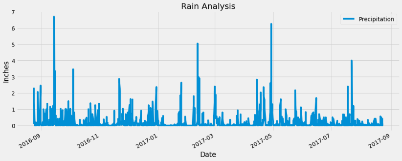
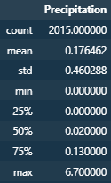
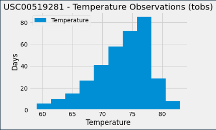

# Exploratory Analysis of Hawaii Climate Data

This project focuses on exploring Hawaii climate data using Python and various libraries such as SQLAlchemy, Pandas, and Matplotlib. The dataset is stored in a SQLite file named `hawaii.sqlite`, which contains two tables: `measurements` and `stations`. We performed exploratory analysis on this dataset to gain insights into Hawaii's climate.

## Dataset

The Hawaii climate database is stored in a SQLite file named `hawaii.sqlite`. The file contains two tables: `measurements` and `stations`

## Dependencies

* Python 3.x
* Flask
* SQLAlchemy
* Pandas
* Matplotlib
* SQLite

## Precipitation Analysis

I performed an exploratory analysis on the precipitation data to understand the rainfall patterns in Hawaii. First I queried the latest date in the dataset and calculated the date one year from the last date in the dataset. Then performed a query to retrieve the data and precipitation scores for the last 12 months. The data was saved as a Pandas DataFrame and sorted by date. We dropped any missing values before plotting the data using Matplotlib. The resulting plot helped us visualize the precipitation data over the last 12 months in Hawaii.



I also calculated the summary statistics for the precipitation data using Pandas. The summary statistics helped me understand the distribution of precipitation in Hawaii.



## Station Analysis

Next I performed an exploratory analysis on the weather stations to understand which stations were the most active and had the most weather measurements recorded.

```
[('USC00519281', 2772),
 ('USC00519397', 2724),
 ('USC00513117', 2709),
 ('USC00519523', 2669),
 ('USC00516128', 2612),
 ('USC00514830', 2202),
 ('USC00511918', 1979),
 ('USC00517948', 1372),
 ('USC00518838', 511)]
```

Then identified the station that had the most weather measurements recorded. 

`'USC00519281'`

Then queried the lowest, highest, and average temperature recorded by this station to understand its temperature ranges.

`[('USC00519281', 54.0, 85.0, 71.66378066378067)]`

I also queried the last 12 months of temperature observation data for this station and plotted the results as a histogram. Showing that high-70s are the most common recored temperature. 



## Flask App

I also created a Flask app that serves Hawaii climate data. By creating Flask routes that correspond to the data analysis performed in the Hawaii Climate Analysis code, we can easily display data as a JSON object. Which then can be displayed on a webpage once deployed. 

## Conclusion

I performed an exploratory analysis on the Hawaii climate dataset. We used Python and various libraries to query, manipulate, and visualize the data. Our analysis helped gain insights into Hawaii's climate patterns, including rainfall and temperature. The Flask app that serves Hawaii climate data through an API routes. The app allows us to easily access the data and use it for further analysis or visualization.

This challenge outlines the steps using Python and SQLAlchemy to do analysis and data exploration of weather data in Hawaii. Then building out an API App that organizes important data from the dataset.
